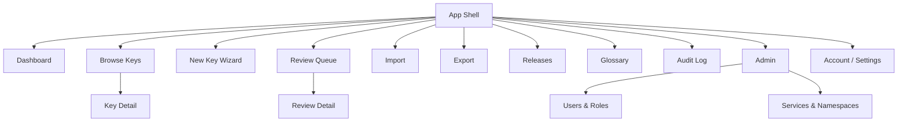
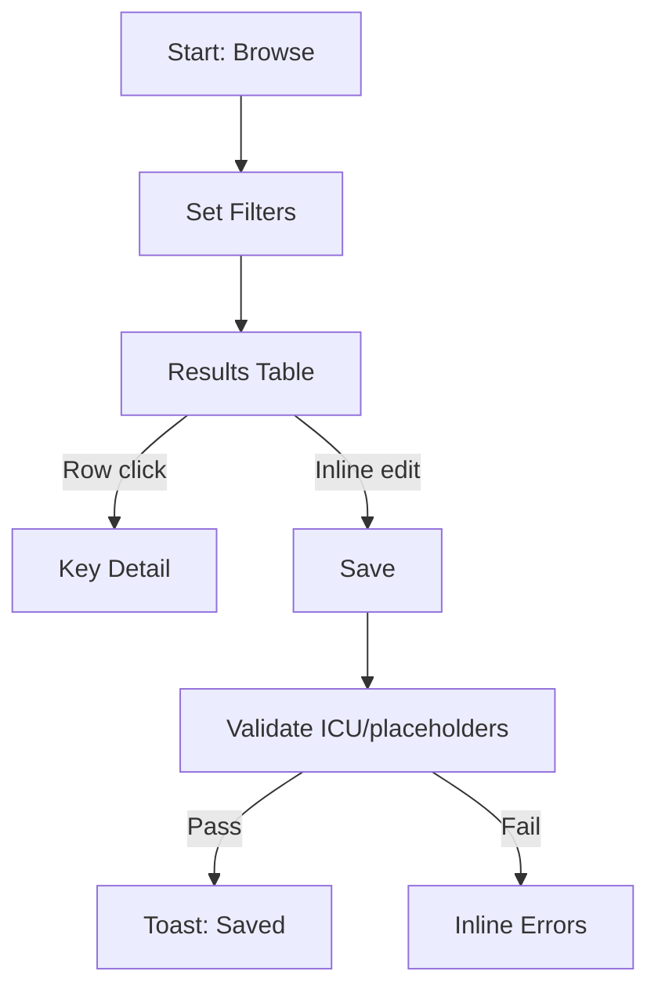
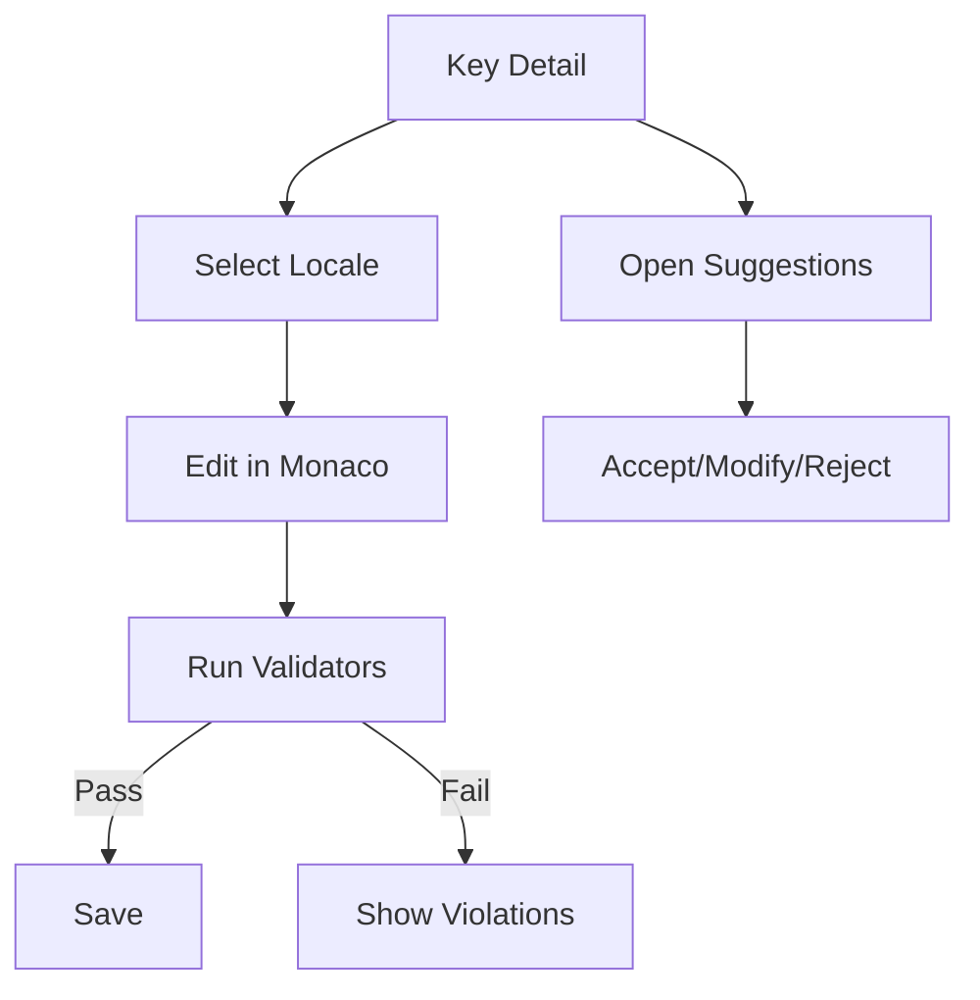
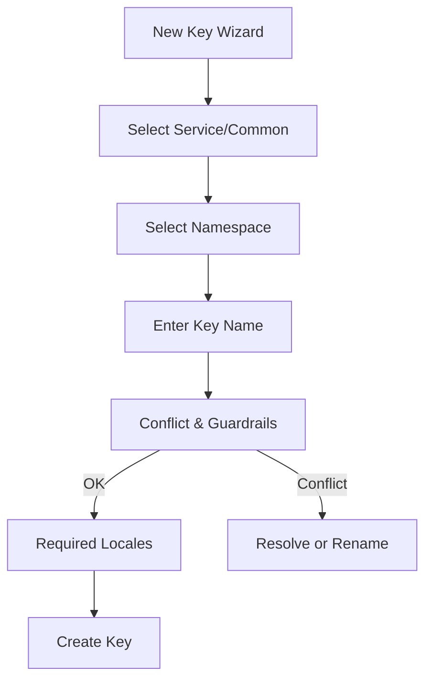
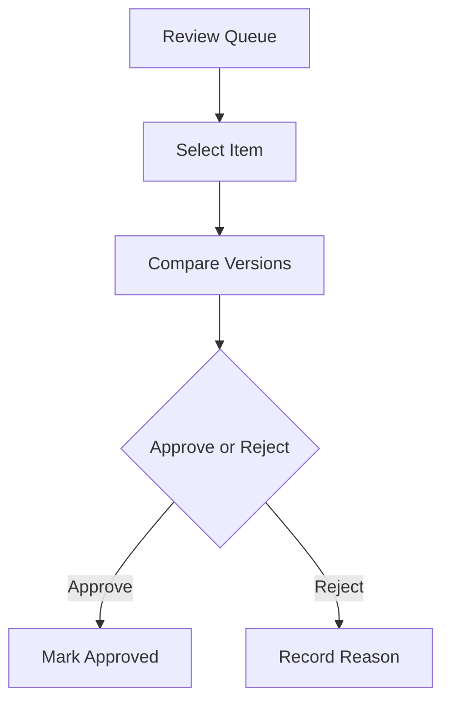
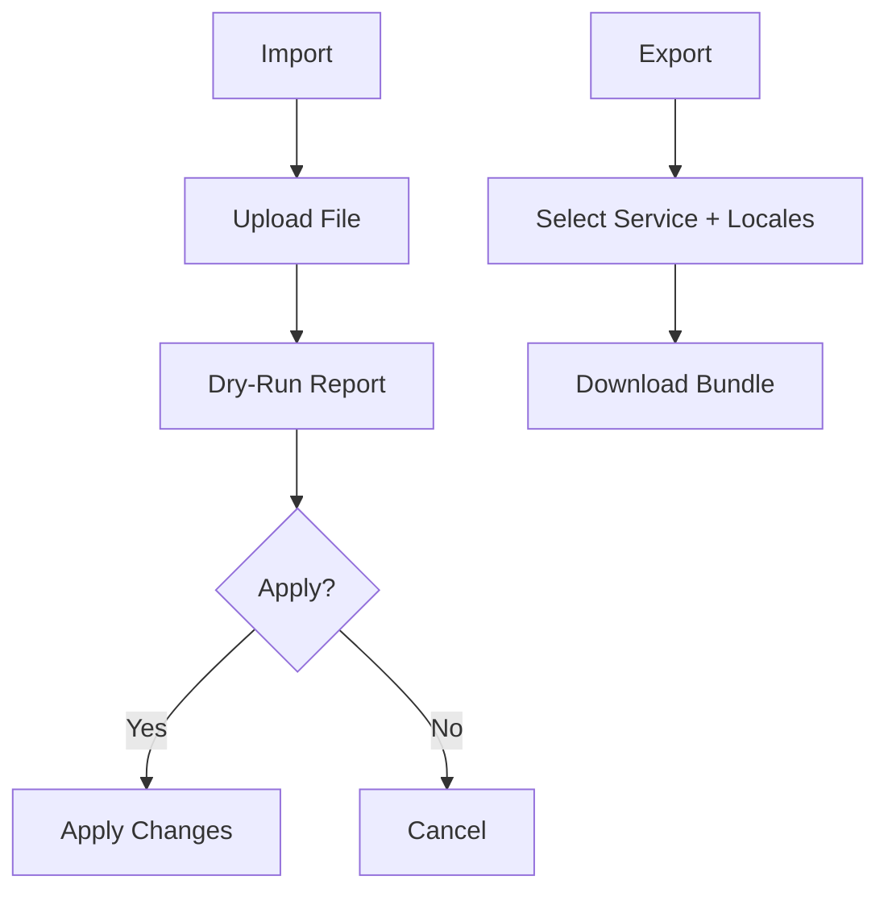

# Language Resource Management Web Service UI/UX Specification

## Introduction

This document defines the user experience goals, information architecture, user flows, and visual design specifications for the Language Resource Management Web Service's user interface. It serves as the foundation for visual design and frontend development, ensuring a cohesive and user-centered experience.

## Overall UX Goals & Principles

### Target User Personas

- **Admin**: Configures system policy, RBAC, and global settings. Needs clarity, safety, and auditability for high‑impact actions.
- **Project Owner**: Manages services/namespaces and releases. Needs overview dashboards, bulk actions, and reliable release workflows.
- **Editor/Translator**: Creates/edits translations. Needs efficient browse/search, inline validation (ICU/placeholders), and helpful AI suggestions.
- **Reviewer**: Reviews/approves changes. Needs clear diffs, context, and low‑friction approve/reject with notes.
- **Viewer**: Read‑only access. Needs easy discovery and trustworthy status indicators.

### Usability Goals

- Ease of learning: New users can find a key and edit a translation within 5 minutes.
- Efficiency: Power users can filter to a target set (<5k keys) and batch apply actions with minimal clicks.
- Error prevention: Deterministic validators block invalid ICU/placeholders; destructive actions require confirmation.
- Memorability: Consistent patterns and clear navigation enable infrequent users to resume quickly.
- Accessibility: Keyboard navigation and screen‑reader labels across all critical workflows.

### Design Principles

1. Clarity over cleverness — prioritize clear communication and data legibility.
2. Progressive disclosure — show only what’s needed, when it’s needed (expand details on demand).
3. Consistent patterns — use shared components and repeatable layouts.
4. Immediate feedback — every action shows success, progress, or error with clear messaging.
5. Accessible by default — meet WCAG 2.1 AA.

### Change Log

| Date       | Version | Description            | Author |
| ---------- | ------- | ---------------------- | ------ |
| 2025-09-10 | 0.1     | Initial draft from PRD | UX     |

## Information Architecture (IA)

### Site Map / Screen Inventory



### Navigation Structure

- **Primary Navigation**: Browse, Review, Import/Export, Releases, Glossary, Audit, Admin
- **Secondary Navigation**: Account/Settings, Help/Docs
- **Breadcrumb Strategy**: Use breadcrumbs for nested contexts (e.g., Browse → Key Detail → Translation ID) to support back‑tracking and deep links.

## User Flows

### Browse & Filter Keys

- **User Goal**: Quickly find a subset of keys by service/common, namespace, locale, status, tags, prefix, and free text.
- **Entry Points**: Global search; left nav “Browse”.
- **Success Criteria**: Filter to desired set; perform inline edits or navigate to Key Detail.



- **Edge Cases & Error Handling**
  - No results → show empty state with tips.
  - Large result set → virtualized table, pagination, saved filters.
  - Server error → non‑blocking inline error with retry.

### Key Detail: Edit Translation

- **User Goal**: View key history and edit translations per locale with validator and AI suggestions.
- **Entry Points**: From Browse table, deep link.
- **Success Criteria**: Validated save; optional suggestion applied with explain‑why.



- **Edge Cases & Error Handling**
  - Placeholder mismatch → block save; highlight tokens.
  - Merge conflict → prompt to review diff and retry.

### New Key Wizard

- **User Goal**: Register a new key with naming guardrails and conflict checks.
- **Entry Points**: New Key button.
- **Success Criteria**: Key created; required locales initialized; conflicts resolved.



- **Edge Cases & Error Handling**
  - Name conflict → guided resolution with suggestions.
  - Missing required locales → cannot complete.

### Review Workflow

- **User Goal**: Approve/reject pending changes per locale with notes.
- **Entry Points**: Review Queue.
- **Success Criteria**: Changes move to Approved; audit updated; required reviewers met.



- **Edge Cases & Error Handling**
  - Missing reviewer → block approval; show required roles.
  - Conflicting updates → force re‑review.

### Import / Export

- **User Goal**: Upload JSON/ICU and get a dry‑run report; export release bundles.
- **Entry Points**: Import/Export in nav.
- **Success Criteria**: Clear report; user applies changes; export downloads bundle.



- **Edge Cases & Error Handling**
  - Invalid file → show structured errors with line refs.
  - Partial apply → summarize successes/failures with retry.

## Wireframes & Mockups

- **Primary Design Files**: Low‑fi wireframes embedded below (no external design tool)

### Key Screen Layouts

#### Browse Keys

- **Purpose**: Discover and narrow to target keys.
- **Key Elements**:
  - Faceted Filter Bar (service/common, namespace, locale, status, tags, prefix)
  - Results Data Table (TanStack Table)
  - Saved Views / Pagination
- **Interaction Notes**: Instant filter apply; URL‑synced state.
- **Low‑fi Wireframe:**

```
+--------------------------------------------------------------------------------+
| Logo     Browse  Review  Import/Export  Releases  Glossary  Audit  Admin  User |
+--------------------------------------------------------------------------------+
| Service | Namespace | Locale | Status | Tags | Prefix | Search [________] [Go] |
+--------------------------------------------------------------------------------+
| Key                              | Locale | Status    | Updated By | Actions  |
| -------------------------------- | ------ | --------- | ---------- | -------- |
| auth.login.title                 | en     | approved  | jlee       | Edit ... |
| auth.login.subtitle              | ko     | missing   | —          | Edit ... |
| ... (virtualized rows)                                                           |
+--------------------------------------------------------------------------------+
|  Rows per page: 50   [Prev] 1 2 3 [Next]                                       |
+--------------------------------------------------------------------------------+
```

#### Key Detail

- **Purpose**: Edit translations with validation and suggestions.
- **Key Elements**:
  - Locale Switcher
  - Monaco Editor with ICU preview
  - History & Diff Panel
  - Suggestions Drawer with score & explain‑why
- **Interaction Notes**: Validator runs on change; non‑blocking suggestions.
- **Low‑fi Wireframe:**

```
+--------------------------------------------------------------------------------+
| ◄ Back     Key: auth.login.title                         Status: Approved      |
+--------------------------------------------------------------------------------+
| Locales: [en] [ko] [ja] [de] [fr]                                              |
+------------------------------+-----------------------------------------------+ |
| Editor (Monaco)              |   History / Diff                              | |
| ---------------------------  | --------------------------------------------- | |
| {name} must be provided.     |  v12 → v13 by jlee (2h ago)                   | |
| Welcome, {name}!             |  Diff: "Welcome, {name}!" → "Welcome!"       | |
|                              |                                               | |
| [Suggest] [Validate] [Save]  |  Comments                                     | |
+------------------------------+-----------------------------------------------+ |
| Suggestions ▸ (score, provider, explain‑why)                                   |
+--------------------------------------------------------------------------------+
```

#### New Key Wizard

- **Purpose**: Safe key creation with guardrails.
- **Key Elements**: Service/Common selector, Namespace selector, Name field with checks, Required locales.
- **Interaction Notes**: Next disabled until checks pass.
- **Low‑fi Wireframe:**

```
+-------------------------------- New Key Wizard --------------------------------+
| Step 1/3  Service/Common: ( ) Service  ( ) Common                               |
|           Service: [ web  v ]   Namespace: [ auth v ]                           |
|                                                                                 |
| Step 2/3  Key Name: [ auth.login.title              ]  [ Check Conflicts ]      |
|           ✓ Follows naming rules       ✕ Conflicts with existing key            |
|                                                                                 |
| Step 3/3  Required Locales: [x] en [x] ko [ ] ja [ ] de [ ] fr                  |
|                                                                                 |
|                    [Cancel]                        [Create Key]                 |
+---------------------------------------------------------------------------------+
```

#### Review Detail

- **Purpose**: Approve/reject with context.
- **Key Elements**: Side‑by‑side compare, comments, approve/reject actions.
- **Low‑fi Wireframe:**

```
+-------------------------------- Review Detail ----------------------------------+
| Queue ◀                                                                           |
+---------------------------+----------------------------+-----------------------+
| Current (en)              | Proposed (en)              | Metadata              |
|---------------------------|----------------------------|-----------------------|
| Welcome, {name}!          | Welcome!                   | Author: tkim          |
|                           |                            | When: 1h ago          |
|                           |                            | Required reviewers: 2 |
+---------------------------+----------------------------+-----------------------+
| Reason (optional): [______________________________________________]             |
| [Reject]                                   [Approve]                            |
+---------------------------------------------------------------------------------+
```

#### Import Report

- **Purpose**: Validate changes before applying.
- **Key Elements**: Summary, errors list, apply button.
- **Low‑fi Wireframe:**

```
+--------------------------------- Import ----------------------------------------+
| Upload JSON/ICU: [ Choose File ]   [ Dry‑Run ]                                   |
+----------------------------------------------------------------------------------+
| Summary: 450 changes (430 OK, 20 warnings, 0 errors)                             |
|                                                                                  |
| Warnings                                                                         |
| - auth.login.title ko: placeholder mismatch {name}                               |
| - settings.save ja: missing translation                                          |
|                                                                                  |
| [Cancel]                                                  [Apply Changes]        |
+----------------------------------------------------------------------------------+
```

## Component Library / Design System

- **Design System Approach**: Use Tailwind CSS utility classes with project tokens. Prefer headless, accessible primitives. Tables via TanStack Table. Monaco for code‑like editing. Theme tokens follow shadcn/ui conventions (CSS variables) generated via Tweakcn.

### Core Components

#### FilterBar

- **Purpose**: Faceted filters and saved views.
- **Variants**: Compact / Expanded.
- **States**: Default, Applied, Disabled.
- **Usage Guidelines**: Debounced apply; reflect in URL params.

#### DataTable

- **Purpose**: Large lists with virtualization.
- **Variants**: Standard, Grouped, With Selection.
- **States**: Loading, Empty, Error.
- **Usage Guidelines**: Column config saved per user; keyboard navigable.

#### KeyDetailPanel

- **Purpose**: Show key metadata, history, and translations.
- **Variants**: Drawer / Full page.
- **States**: Loading, Read‑only, Editing.
- **Usage Guidelines**: Keep critical info above the fold; diff is prominent during review.

#### TranslationEditor (Monaco)

- **Purpose**: Edit ICU/placeholder‑aware strings.
- **Variants**: Single‑line / Multiline.
- **States**: Valid, Invalid, Suggestion Applied.
- **Usage Guidelines**: Highlight placeholders; show inline violations with fixes.

#### ReviewActions

- **Purpose**: Approve/reject with notes and requirements.
- **Variants**: Single / Batch.
- **States**: Pending, Approved, Rejected.
- **Usage Guidelines**: Confirm destructive actions; show required reviewers.

#### ImportReport

- **Purpose**: Present dry‑run results.
- **Variants**: Summary / Detailed.
- **States**: Success, Partial, Error.
- **Usage Guidelines**: Emphasize blocking vs advisory issues.

#### ReleaseBuilder

- **Purpose**: Configure and export release bundles.
- **Variants**: Simple / Advanced options.
- **States**: Ready, In Progress.
- **Usage Guidelines**: Show snapshot reference and audit linkage.

#### TagCombobox

- **Purpose**: Assign tags with typeahead.
- **Variants**: Single / Multi‑select.
- **States**: Loading, Selected, Disabled.
- **Usage Guidelines**: Keep tag vocab discoverable; allow creation if permitted.

#### StatusBadge

- **Purpose**: Indicate translation/key status (draft, review, approved, missing).
- **Variants**: Color/status variants.
- **States**: Default, Attention.
- **Usage Guidelines**: Consistent legend across app.

#### Pagination

- **Purpose**: Navigate large datasets.
- **Variants**: Simple / Detailed.
- **States**: Disabled at bounds.
- **Usage Guidelines**: Keyboard accessible; large clickable targets.

#### Toolbar

- **Purpose**: Contextual actions above lists/detail views.
- **Variants**: With selection / Without.
- **States**: Actions enabled/disabled by selection and role.
- **Usage Guidelines**: Group destructive actions; confirm.

## Branding & Style Guide

- **Brand Guidelines**: Theme managed with shadcn/ui tokens; palette generated via Tweakcn editor ([tweakcn theme editor](https://tweakcn.com/editor/theme)).

### Color Palette

| Color Type | Hex Code | Usage                      |
| ---------- | -------- | -------------------------- |
| Primary    | #4F46E5  | Primary actions, links     |
| Secondary  | #64748B  | Secondary actions          |
| Accent     | #22C55E  | Highlights, tags           |
| Success    | #16A34A  | Positive feedback          |
| Warning    | #F59E0B  | Cautions                   |
| Error      | #EF4444  | Errors, destructive        |
| Neutral    | #0F172A  | Text, borders, backgrounds |

### Typography

- **Primary**: Pretendard, system-ui, -apple-system, Segoe UI, Roboto, "Helvetica Neue", Arial, "Apple SD Gothic Neo", "Noto Sans", "Malgun Gothic", sans-serif
- **Secondary**: (none)
- **Monospace**: ui-monospace, SFMono-Regular, Menlo, Monaco, Consolas, "Liberation Mono", "Courier New", monospace

#### Type Scale

| Element | Size | Weight | Line Height |
| ------- | ---- | ------ | ----------- |
| H1      | 30px | 700    | 1.2         |
| H2      | 24px | 700    | 1.3         |
| H3      | 20px | 600    | 1.4         |
| Body    | 16px | 400    | 1.6         |
| Small   | 14px | 400    | 1.5         |

### Iconography

- **Icon Library**: Lucide (shadcn/ui default)
- **Usage Guidelines**: Prefer semantic icons; label where ambiguous.

### Spacing & Layout

- **Grid System**: 12‑column responsive grid.
- **Spacing Scale**: Tailwind 4/8‑point scale.

## Accessibility Requirements

- **Standard**: WCAG 2.1 AA

### Key Requirements

- **Visual**
  - Color contrast ratios ≥ AA
  - Visible focus indicators on all focusable elements
  - Scalable text without breaking layout
- **Interaction**
  - Full keyboard navigation for tables, forms, and dialogs
  - Screen reader labels for controls; ARIA where needed
  - Touch targets ≥ 44×44 px
- **Content**
  - Alt text for icons/images; meaningful button labels
  - Logical heading structure per page
  - Proper form labels, helper text, and error messages

### Testing Strategy

- Axe/lighthouse checks in CI; manual keyboard and SR passes for critical flows.

## Responsiveness Strategy

### Breakpoints

| Breakpoint | Min Width | Max Width | Target Devices                  |
| ---------- | --------- | --------- | ------------------------------- |
| Mobile     | 0px       | 639px     | Phones                          |
| Tablet     | 640px     | 1023px    | Small tablets, landscape phones |
| Desktop    | 1024px    | 1279px    | Laptops                         |
| Wide       | 1280px    | -         | Desktops, large monitors        |

### Adaptation Patterns

- **Layout Changes**: Single‑column on mobile; two‑pane (table + detail) on desktop where space allows.
- **Navigation Changes**: Collapsible nav on mobile; persistent on desktop.
- **Content Priority**: Filters before results on mobile; side panel on desktop.
- **Interaction Changes**: Larger hit areas on touch; hover affordances on desktop.

## Animation & Micro‑interactions

- **Motion Principles**: Subtle, purposeful; prefer 150–250ms durations; respect reduced‑motion.
- **Key Animations**
  - Filter apply → progress/skeleton shimmer
  - Save success → brief toast
  - Validation errors → gentle field highlight

## Performance Considerations

### Performance Goals

- **List P95**: ≤ 300ms for 5k keys (from PRD)
- **Search P95**: ≤ 800ms (from PRD)
- **Page Load (FCP)**: ≤ 2.5s on median devices/network
- **Interaction Response**: ≤ 100ms for UI feedback
- **Animation FPS**: 60fps target; avoid long main‑thread blocks

### Design Strategies

- Prefer server pagination and virtualization for large tables.
- Defer non‑critical data; optimistic UI for common actions.
- Cache suggestion data; debounce filters/search.

## Next Steps

### Immediate Actions

1. Provide branding (palette, fonts) and icon library preferences.
2. Share design tool link (Figma/Sketch) or request low‑fi wireframes.
3. Confirm navigation labels and primary sections.
4. Prioritize flows for high‑fidelity design.

### Design Handoff Checklist

- [ ] All user flows documented
- [ ] Component inventory complete
- [ ] Accessibility requirements defined
- [ ] Responsive strategy clear
- [ ] Brand guidelines incorporated
- [ ] Performance goals established

## Checklist Results

- [Pending] Run UI/UX checklist after branding and wireframes are defined.
